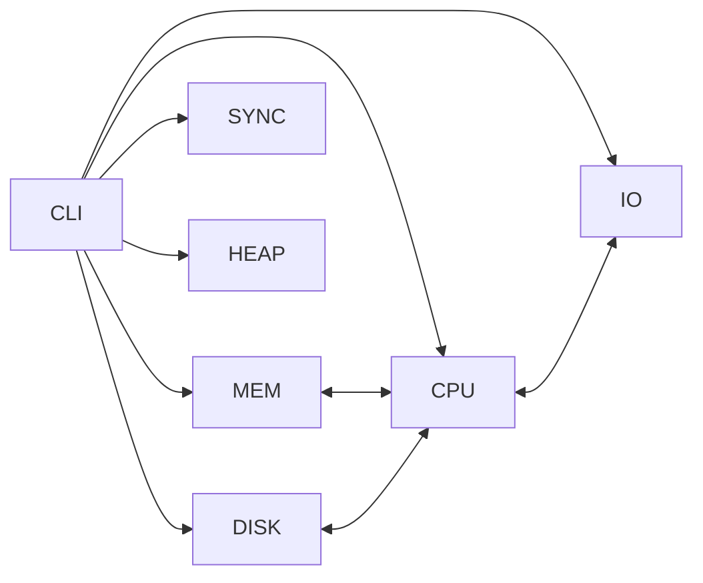

# Informe Técnico – Kernel-Sim

**Curso:** Sistemas Operativos — Proyecto Final  
**Integrantes:** *(complete nombres)*  
**Fecha:** *(completar)*

## 1. Arquitectura y Módulos
- **CPU / Planificación:** RR (expropiativo, `quantum` configurable) y SJF (no expropiativo).
- **Memoria Virtual:** Paginación con **FIFO**, **LRU** y **Working Set (WS, `tau`)**.
- **Sincronización:** Semáforos, Productor–Consumidor, Filósofos.
- **Disco:** FCFS, SSTF, SCAN; export **CSV** + script de gráfico.
- **Heap (nuevo):** Asignador **Buddy** con CLI: `heap init/alloc/free/stats`.

Diagrama (Mermaid):

## 2. Memoria Virtual
**Algoritmos:** FIFO, LRU, WS(`tau`).  
**Métricas:** `hits`, `misses`, razón de fallos.  
**Visualización:** En `mem show` se resalta en **verde** el frame del último acceso; frames vacíos se muestran **atenuados**.

**Experimentos reproducibles:** `scripts/mem/*.txt` + `scripts/tools/plot_memory.py`.  
*(Incluir figuras exportadas en `scripts/figs/`)*

**Resultados y análisis:** *(completar con gráficas y discusión de cuándo conviene cada política)*

## 3. Heap – Asignador Buddy (nuevo)
CLI: `heap init N`, `heap alloc N`, `heap free ID`, `heap stats`.  
**Métricas:** fragmentación (bloques libres), bytes usados/libres, coalescencia.  
**Diseño:** partición binaria con coalescencia por buddy (`off ^ size`).

## 4. Planificación de Disco
**Algoritmos:** FCFS, SSTF, SCAN.  
**Export:** `disk dump path.csv` + `python scripts/tools/plot_disk.py path.csv out.png`.  
**Visualización:** `disk show` incluye línea de cilindros y marca de cabezal.

**Resultados comparativos (movimiento total):** *(adjuntar tabla/figura; mismo set de solicitudes)*

## 5. Sincronización
**Productor–Consumidor** (buffer acotado), **Filósofos** (estrategia “camarero”).  
**Pruebas:** throughput y ausencia de interbloqueo/hambruna en escenarios de carga.

## 6. Interfaz de Usuario (CLI)
Comandos documentados con `help`. Se añadieron **colores ANSI** en memoria y una vista visual del **disco**.

## 7. Conclusiones
- LRU minimiza fallos en patrones con localidad; FIFO sensible a anomalía de Belady.
- WS se adapta al *working set* real si `tau` aproxima bien la ventana temporal.
- En disco, **SSTF** reduce movimiento pero puede sesgar; **SCAN** balancea equidad.
- Buddy logra **buenas latencias** y coalescencia efectiva en cargas mixtas.

## 8. Reproducibilidad
```
# Disco
disk init 200 40
disk policy sstf
disk req 98
disk req 183
disk req 37
disk req 122
disk req 14
disk req 124
disk req 65
disk req 67
disk run
disk dump scripts/results/sstf.csv
python scripts/tools/plot_disk.py scripts/results/sstf.csv scripts/figs/sstf.png

# Heap
heap init 1024
heap alloc 100
heap alloc 200
heap stats
```
